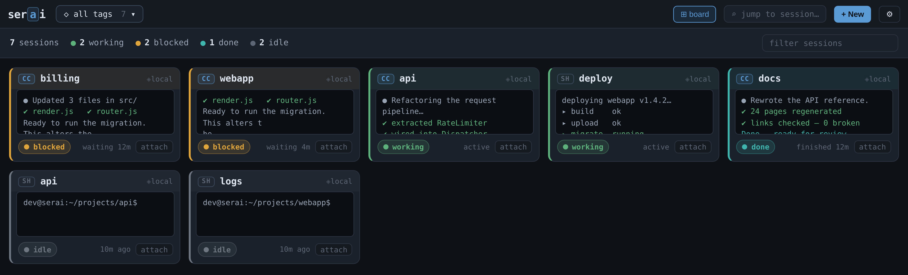
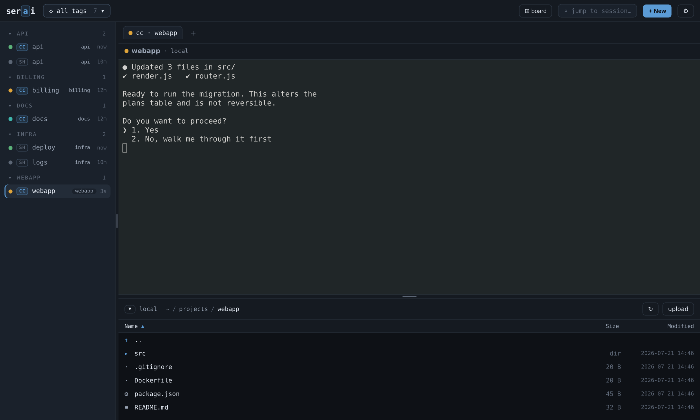
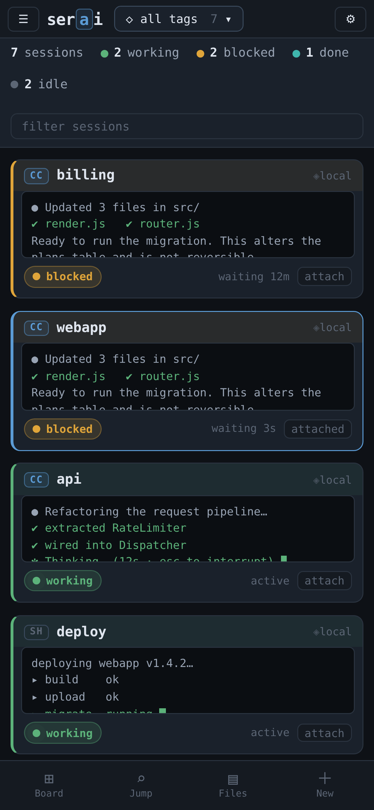
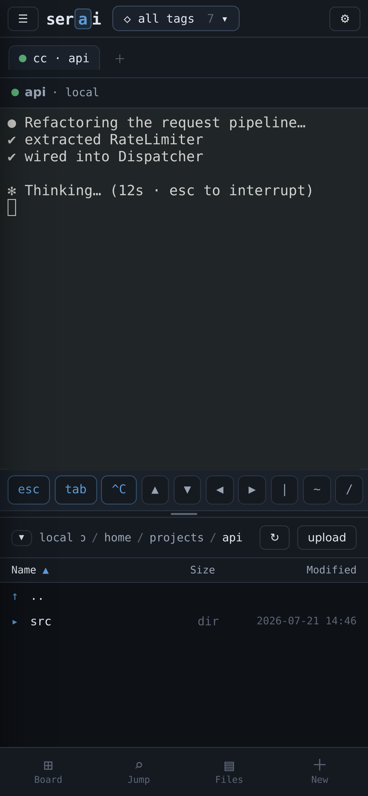

# serai

A single attach point for your terminal, SSH, and Claude Code sessions — across
the local machine and remote hosts — backed by tmux for persistence.

When you run a dozen coding agents at once, the hard question stops being "where
is my terminal" and becomes **"which of these needs me right now?"** serai answers
that first: it opens on a board of every session, colour-coded by what each one is
actually doing, with a few lines of live pane output on each card. Click one to
attach.

It holds **none of your fleet's credentials** — remote work goes through your
ssh-agent, and tmux keeps every session alive when you detach.



## What it does

**The board** is the landing view. One card per session, sorted so whatever needs
you floats to the top, each showing a live preview of the pane so you can triage
without attaching.

Every session reads as one of four states:

| | meaning | how it's detected |
|---|---|---|
| **working** | busy right now | Claude: its status line says a turn is running. Shell: a non-shell process in the foreground, or fresh output. |
| **blocked** | waiting on you | a prompt marker in the pane tail — a permission ask, `[sudo] password`, `(y/n)` |
| **done** | finished, unread | a Claude session parked back at its prompt after recent activity, that you haven't opened |
| **idle** | at rest | a shell at its prompt, or a session dormant a while |

Detection is a heuristic, and deliberately a cheap one: it reuses the pane capture
already taken for the preview plus two fields tmux hands over for free, so a large
fleet costs no extra round trips. See [Tuning](#tuning) to adjust the windows.

**The attached view** puts a compact rail of every session beside your terminals —
grouped by tag, each row carrying its own state dot — with the file browser as a
drawer underneath.



- **Terminals** attach over a websocket-backed PTY. Local and remote are the same
  code path — remote just wraps the tmux command in `ssh -t`. A dropped socket
  reattaches to the same session automatically, because tmux kept it alive. Open
  several as tabs, or split up to six panes.
- **Files** browses any host — local filesystem or SFTP — with cut/copy/paste,
  rename, delete, new folder, multi-select, and drag-and-drop upload. Copying
  between two hosts relays as a streamed tar, so a multi-GB tree moves at a fixed
  memory cost and reports bytes as it goes.
- **Jump** (or double-tap `Shift`) fuzzy-finds any session by name.
- **Fleet broadcast** sends one command line to several sessions at once.

## Workspaces are your tags

Tag a session and it groups by that tag — in the rail, and in the workspace picker
in the top bar. Filtering to a tag narrows the board and the rail together, which
is how you carve a couple of dozen sessions into projects.

Tags live on the tmux session itself (a `@serai_tags` user option), so they
persist for the session's lifetime with no external store.

Hosts can carry their own grouping metadata in `~/.ssh/config`, as comments ssh
ignores:

```
# @group web-stack
# @tags prod,docker
Host web-01
    HostName 192.0.2.21
    User deploy
```

## The session model

Every session is `where × what × persistence`:

| | command run under the PTY |
|---|---|
| local shell  | `tmux new -A -s shell-main` |
| local claude | `tmux new -A -s cc-webapp 'cd ~/projects/webapp && claude'` |
| remote shell | `ssh web-01 -t tmux new -A -s shell-deploy` |
| remote claude| `ssh web-01 -t tmux new -A -s cc-api 'cd ~/app && claude'` |

Naming tells serai what a session is:

- `cc-<project>` or `<project>-claude` → a Claude Code session
- `shell-<name>` or `<name>-term` → a plain shell

The suffix forms are recognised so sessions you created outside serai are picked
up as-is, rather than needing a rename.

**Start in** — give a session a directory when you create or edit it, and both the
terminal and the file browser open there. It's stored on the session, so it
survives you `cd`-ing elsewhere and is reused when restoring after a reboot.

**After a reboot**, serai offers to bring back the sessions that were open, with a
per-session choice of how each Claude session returns: continue the last
conversation, open its resume picker, or start fresh.

## On a phone

The same app, laid out for one thumb: the board becomes a single column, the rail
slides in as a drawer, and the terminal gets a key bar for the keys a soft
keyboard doesn't have — `esc`, `tab`, `^C`, arrows, `|`, `~`, `/`. Long-press a
file for its actions.

<p>
  
  
</p>

## Run it

```bash
./run.sh                 # https://127.0.0.1:8022 (self-signed cert)
SERAI_PORT=9000 ./run.sh
```

serai serves **HTTPS by default**. On first run it generates a self-signed cert
under `~/.config/serai/`; your browser will warn it's untrusted — accept it once.
To use your own cert:

```bash
SERAI_CERT=/etc/ssl/serai.crt SERAI_KEY=/etc/ssl/serai.key ./run.sh
SERAI_TLS=off ./run.sh    # plain http: localhost only, or behind a TLS proxy
```

To reach serai from the LAN, bind beyond localhost and make sure the cert covers
the name you'll use:

```bash
SERAI_HOST=0.0.0.0 SERAI_HOSTNAME=serai.home.example ./run.sh
```

Requirements: `tmux` locally, and `ssh` + `tmux` on any remote host you attach to.
Keys come from your ssh-agent (`ssh-add -l` to check). Python ≥3.10. The web UI
(xterm.js) is vendored, so nothing is fetched at runtime.

## Run as a service

```bash
./install.sh                                 # interactive: asks how you'll reach serai
./install.sh --hostname serai.lan,192.0.2.5  # or set it up front
./install.sh --system                        # system unit (sudo) instead of a user unit
```

The installer **copies the app out of your checkout** to `~/.local/share/serai`
and runs the service from there, so your working tree is only the source — dev
notes and `.git` never reach the runtime. It writes an editable env file at
`~/.config/serai/serai.env`, installs the unit, and enables it (a user service by
default, lingering so it starts at boot).

Re-running it updates in place, and **only restarts when backend code changed** —
a frontend-only update deploys without dropping a single attached session.

```bash
systemctl --user status serai
journalctl --user -u serai -f        # logs, incl. the first-run setup code
```

Preview either script with `--dry-run`. To remove serai, `./uninstall.sh` (keeps
your config and credentials; `--purge` removes those too). Your tmux sessions are
never touched.

An admin can change the listen address and certificate hostnames later from the
web UI — account menu → **Network** — without re-running the installer.

## Logging in

serai is a single attach point into your whole fleet, so it ships with a login.
On a fresh install the **first person to open it creates the admin account**; from
then on everyone signs in, and admins manage users from the account menu. Set it
up promptly — until that first account exists, anyone who can reach serai could
claim it.

If that window worries you, `SERAI_SETUP_CODE=1` makes the first-run screen
require a one-time code printed to the service log, so only someone with shell
access can create the admin.

Passwords are stored only as **scrypt hashes** in `~/.config/serai/users.json`;
sessions are HMAC-signed, httpOnly cookies. Locked out? `python -m serai.auth add
<user> --admin` works from the host shell. For a trusted localhost, `SERAI_AUTH=off`.

## Security notes

- Binds to `127.0.0.1` by default and serves HTTPS, so the login isn't sent in the
  clear on your network. The login and TLS are **defence in depth**, not a reason
  to expose it — still front serai with a reverse proxy, VPN, or LAN bind.
- **Stores no remote credentials**: no host list, no ssh keys, no remote passwords.
  The ssh config is read-only, sessions live in tmux, and transfers use your
  agent-authenticated SSH. The only secret it keeps is its **own** login.
- Host aliases, session names, and paths are treated as hostile input and never
  interpolated into a shell string — every command is built as an argv list.

## Tuning

Everything below is optional; the defaults are sensible.

| variable | does |
|---|---|
| `SERAI_HOST` / `SERAI_PORT` | listen address (default `127.0.0.1:8022`) |
| `SERAI_TLS` / `SERAI_CERT` / `SERAI_KEY` / `SERAI_HOSTNAME` | TLS and the names the generated cert covers |
| `SERAI_AUTH` / `SERAI_SETUP_CODE` / `SERAI_SESSION_TTL` | login behaviour |
| `SERAI_WORKING_WINDOW` | seconds of quiet before a shell stops reading as *working* (20) |
| `SERAI_DONE_WINDOW` | how long a finished Claude session shows as *done* (1800) |
| `SERAI_WAIT_MARKERS[_CLAUDE\|_SHELL]` | extra phrases that mean "blocked", comma-separated |
| `SERAI_TMUX_CACHE_TTL` | how long remote session discovery is cached (3s) |
| `SERAI_CONFIG_DIR` | where config, credentials, and the cert live |

## Known rough edges

- **"blocked" is a heuristic.** It scans the last few non-blank lines of the
  visible pane, so a session genuinely waiting can read as idle if its prompt has
  scrolled or reflowed out of that window. Widening the window would trade this
  for stale-prompt false positives. Extend the markers with the env vars above.
- **Downloads are buffered in the page.** A file is fetched into browser memory
  before it's saved, so serai warns before very large ones. This is a consequence
  of the self-signed certificate — browsers refuse ordinary downloads from an
  origin with a certificate error.
- **A cross-host folder copy has no progress bar**, only a running byte count —
  a tar stream doesn't know its own size, so there's no honest denominator.

## License

MIT — see [LICENSE](LICENSE).
